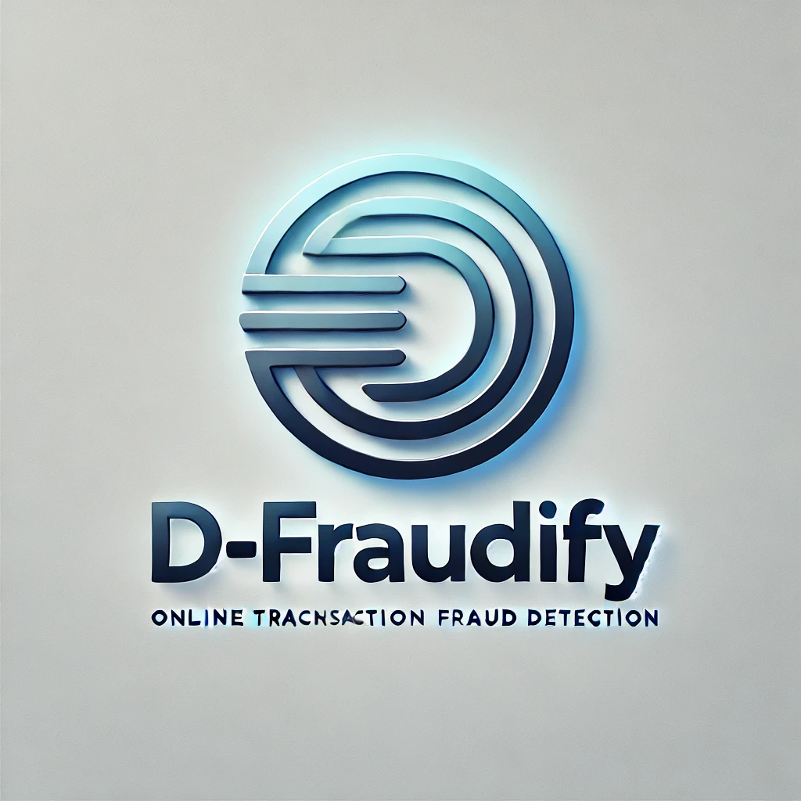

# D-Fraudify



D-Fraudify is a machine learning-driven solution for detecting online payment fraud. This project utilizes advanced models and intuitive user interfaces to provide a streamlined fraud detection pipeline. It is suitable for research, education, and real-world applications in financial fraud prevention.

---

## Table of Contents

- [Introduction](#introduction)
- [Features](#features)
- [Installation](#installation)
- [Usage](#usage)
- [Project Structure](#project-structure)
- [Dataset](#dataset)
- [Contributing](#contributing)
- [License](#license)
- [Contact](#contact)

---

## Introduction

Fraud detection in online payments is critical for financial security. D-Fraudify provides a comprehensive framework that integrates machine learning models with a user-friendly interface for detecting fraudulent transactions. With real-world datasets and efficient algorithms, the project ensures accuracy and scalability.

---

## Features

- **Machine Learning Models**: Includes a trained Decision Tree model (`dtmodel.pkl`).
- **User Interface**: A Python-based user interface (`ui.py`) for easy interaction.
- **Notebook for Exploration**: An interactive Jupyter notebook for exploring fraud detection strategies.
- **Pre-trained Model**: Ready-to-use fraud detection model.
- **Open Source**: Fully customizable and extendable for further enhancements.

---

## Installation

1. Clone the repository:
    ```bash
    git clone https://github.com/gp0814/D-Fraudify.git
    cd D-Fraudify
    ```

2. Install dependencies:
    ```bash
    pip install -r requirements.txt
    ```

3. (Optional) Run the application locally:
    ```bash
    python ui.py
    ```

---

## Usage

1. **Interactive Notebook**: Explore the `online-payment-fraud-detection.ipynb` file to understand the model training and testing process.
2. **Model Integration**: Use the pre-trained `dtmodel.pkl` file for predictions.
3. **Run Interface**: Launch `ui.py` to test fraud detection in an interactive environment.

---

## Project Structure

- `ui.py`: The user interface for running the model locally.
- `dtmodel.pkl`: Pre-trained Decision Tree model.
- `online-payment-fraud-detection.ipynb`: Jupyter notebook for model exploration.
- `requirements.txt`: List of dependencies.
- `logo.webp`: Logo for the project.
- `Procfile`: Configuration for deploying to platforms like Heroku.

---

## Dataset

The project leverages an online payment fraud dataset for model training and testing. You can experiment with publicly available datasets, such as:

- [Kaggle Credit Card Fraud Detection Dataset](https://www.kaggle.com/mlg-ulb/creditcardfraud)

Ensure your dataset is formatted appropriately before use.

---

## Contributing

We welcome contributions to enhance the project! Here's how you can help:

1. Fork the repository.
2. Create a new branch for your feature:
    ```bash
    git checkout -b feature/YourFeature
    ```
3. Commit your changes:
    ```bash
    git commit -m "Add your feature"
    ```
4. Push your changes:
    ```bash
    git push origin feature/YourFeature
    ```
5. Open a pull request.

---

## License

This project is licensed under the MIT License. See the [LICENSE](LICENSE) file for details.

---

## Contact

For questions, feedback, or collaboration:

- **Author**: [gp0814](https://github.com/gp0814)
- **Email**: gkp5625@gmail.com
- **Issues**: [Create an Issue](https://github.com/gp0814/D-Fraudify/issues)

---

Thank you for exploring D-Fraudify!
